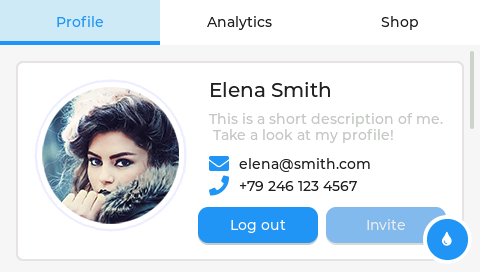

---
parent: Example Applications
title: LVGL Showcase
nav_order: 1
---

# LVGL Showcase

This application demonstrates a simple way to create a graphics application using the LVGL graphics library that directly uses the LCD controller driver.

|MPLABX Configuration|Board Configuration|
|:-------------------|:------------------|
|[lvgl\_sc\_9x60\_cu\_tm5000.X](./firmware/lvgl_sc_9x60_cu_tm5000.X/readme.md)| [SAM 9x60 Curiosity Development Board](https://www.microchip.com/en-us/development-tool/EV40E67A) using LCDC internal graphics controller to drive the [High-Performance WVGA Display Module with maXTouch® Technology](https://www.microchip.com/DevelopmentTools/ProductDetails/PartNO/AC320005-5)|
