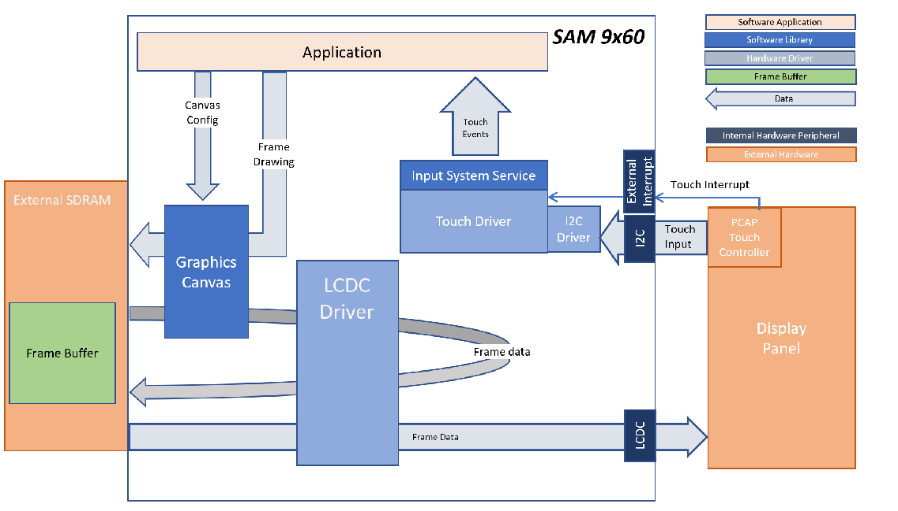
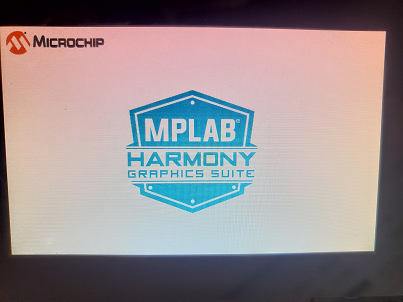

 blank\_cqs\_9x60\_cu\_tm5000.X

Defining the Architecture
-------------------------

The application calls directly into LCD Controller (LCDC) driver set up and initialization function calls that configure the LCDC. After initialization, the application transitions into the paint phase, where it uses Canvas Graphics library to draw an image to the frame buffer. Pressing down on the LCD turns on the BLUE LED and when touch is removed the BLUE LED turns off. Each time the user touches the LCD, the image displayed is switched.  

User touch input on the display panel is received thru the PCAP capacitive touch controller, which sends a notification to the Touch Input Driver. The Touch Input Driver reads the touch information over I2C and sends the touch event to the Graphics Library thru the Input System Service.

### Demonstration Features

-   Graphics Acceleration using integrated display controller (LCDC)
-   Graphics Canvas
-   Reference application for the SAM 9x60 Curiosity development board
-   18-bit color, multi-layer, WVGA (800x480) screen design
-   Time system service, timer-counter peripheral library and driver 
-   I2C and touch controller driver 

Creating the Project Graph
--------------------------

The Project Graph diagram shows the Harmony components that are included in this application. Lines between components are drawn to satisfy components that depend on a capability that another component provides.

Building the Application
------------------------

The parent directory for this application is gfx/apps/blank\_canvas\_quickstart. To build this application, use MPLAB X IDE to open the gfx/apps/blank\_canvas\_quickstart/firmware/blank\_cqs\_9x60\_cu\_tm5000.X project folder and press F11.
A successful build will generate a harmony.bin file in dist\lcdc_rgba8888_mxt_9x60_cu_wvga\production in the project folder.

The following table lists configuration properties:

|Project Name|BSP Used|Graphics Template Used|Description|
|:-----------|:-------|:---------------------|:----------|
|blank\_cqs\_9x60\_cu\_tm5000.X|[SAM 9X60 CURIOSITY BSP](https://www.microchip.com/en-us/development-tool/EV40E67A) |None|[SAM9x60 Curiosity development board](https://www.microchip.com/en-us/development-tool/EV40E67A) with [RGBA8888 GFX Interface and 5" WVGA PCAP Touch display](https://www.microchip.com/DevelopmentTools/ProductDetails/PartNO/AC320005-5)|

Configuring the Hardware
------------------------

Configure the hardware as follows:

-   Connect the ribbon cable from the display to the J13 connector of the SAM 9x60 Curiosity Development Board.

-	Take an SD Card formatted with FAT32 file system, and copy the boot.bin binary file from this [location](../../../Sam9x60_Curiosity/boot.bin). Also copy the harmony.bin file you generated from the "Building the Application" section.

-   Insert the SD card to J3 of the SAM 9X60 Curiosity development board and power up the board by connecting the powered USB cable to the USB port J1 on the SAM 9x60 curiosity development board.

Running the Demonstration
-------------------------

When power-on is successful, the demonstration will display an image similar to the picture shown below (different configurations may have slight variation in the screen aspect ratio):

Touching the LCD will turn on the blue LED and when touch is removed, the image below is displayed:

With every touch on the LCD, the displayed image swaps between the two pictures shown above.
* * * * *

 
