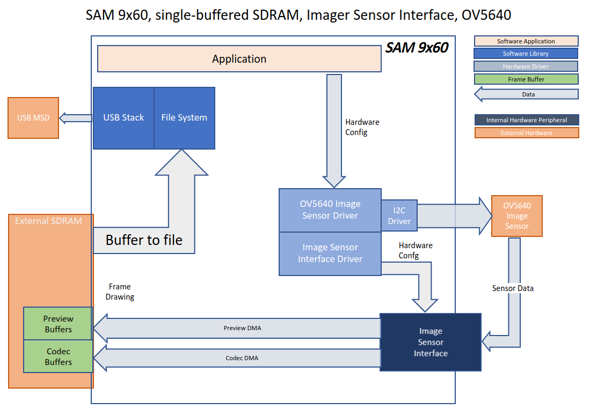
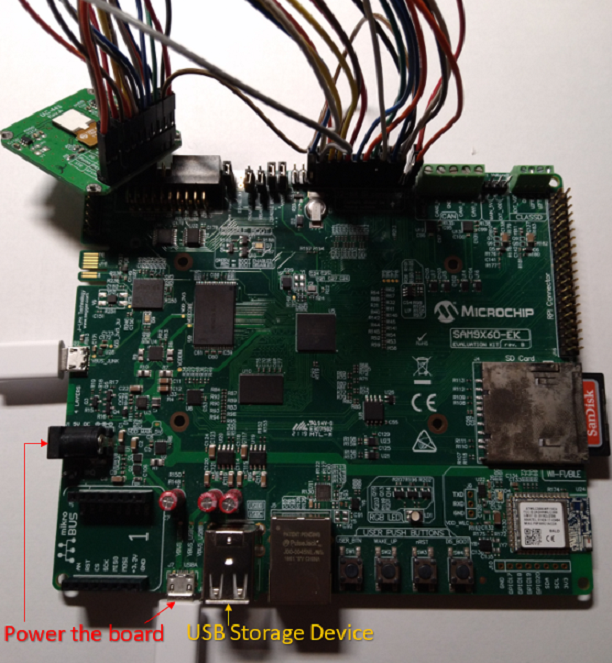

 isi\_cam\_sam9x60\_ek.X

Defining the Architecture
-------------------------

This application demonstrates how to use the Image Sensor Interface peripheral with an off-the-shelf image sensor. For this example, an arducam OV5640
Camera Module is used. The application will store the captured images to a USB storage device in TGA format. When user pushes SW1 button, a full-size ISI codec 
capture is initiated and the image is stored in the USB storage device.

### Demonstration Features

-   Image Sensor Interface
-   USB MSD Write
-   Analog Button

Creating the Project Graph
--------------------------

The Project Graph diagram shows the Harmony components that are included in this application. Lines between components are drawn to satisfy components that depend on a capability that another component provides.

The I2C driver in this project is used for communication with the OV5640 image sensor.

The pins are configured as follows:

|Pin Number|Pin ID|Custom Name|Function|Direction|Latch|PIO Interrupt|
|:-----------|:-------|:----------|:----------|:----------|:----------|:----------|
|P2|PA0||FLEXCOM0_IO0|n/a|n/a|Disabled|
|M3|PA1||FLEXCOM0_IO1|n/a|n/a|Disabled|
|D6|PB13|LED\_RED|LED\_AH|Out|Low|Disabled|
|C2|PB12|LED\_GREEN|LED\_AH|Out|Low|Disabled|
|A4|PB13|LED\_BLUE|LED\_AH|Out|Low|Disabled|
|R6|PC16|BSP\_OV5640_RESET|GPIO|Out|High|Disabled|
|R8|PC24|BSP\_OV5640_PDNW|GPIO|Out|High|Disabled|
|L13|PD18|SWITCH_AL_PD18|SWITCH\_AL|In|Low|Both Edge|

The interrupt for PIOD_IRQn (the interrupt for SW1) needs to be set to a higher priority than the default.  For the purposes of this demo it is set to "Very High Priority".

The peripheral clocks need to be turned on for "ISI", "PIOD", and "UHPHS_EHCI".

Programmable Clock Controler 0 (PCLK0) needs to be enabled and needs to be configured to use the MAINCK as its source. This provides a 12 MHz clock pulse to the OV5640 module.

<b>Note:  The OV5640 image sensor is an off-the-shelf module and is not officially supported by MPLAB Harmony 3.   While a driver for this module is included as part of this demo, it is not guaranteed to be complete.  Nor are the OV5640 configuration values guaranteed to be optimal.  Consequently, the images produced by this demo may be of lower quality.  The primary purpose of this application is to demonstrate the functionality of the Image Sensor Interface module.  Additional user effort may be required to determine the most optimal camera module settings.</b>

Building the Application
------------------------

The parent directory for this application is gfx/apps/isi\_camera. To build this application, use MPLAB X IDE to open the gfx/apps/isi\_camera/start/firmware/isi\_cam\_sam9x60\_ek.X project folder and press F11.
A successful build will generate a harmony.bin file in dist\9x60\production in the project folder.

The following table lists configuration properties:

|Project Name|BSP Used|Description|
|:-----------|:-------|:----------|
|isi_cam_sam9x60_ek.X|[SAM 9x60 Evaluation Kit](https://www.microchip.com/developmenttools/ProductDetails/DT100126)|9x60 Evaluation Kit Image Sensor Interface and OV5640 image sensor.|

<b>Note:  This application may contain custom code that is marked by the comments // START OF CUSTOM CODE ... and // END OF CUSTOM CODE. When using the MPLAB Harmony Configurator to regenerate the application code, use the "ALL" merging strategy and do not remove or replace the custom code.</b>

Configuring the Hardware
------------------------

Configure the hardware as follows:

-	The OV5640 CMOS camera module is wired to the 12-bit ISI conector (J17) on the SAM9X60-EK using the following wiring diagram:

| Module Function | OV5640 Module Pin |  ISI Pin  | ISI Function |
|:---------------:|:-----------------:|:---------:|:------------:|
|       VCC       |      1            |     1     |    3.3 VCC   |
|       GND       |      2            |     9     |      GND     |
|       SCL       |      3            |  7 (PA00) |   TWI Clock  |
|       SDA       |      4            |  8 (PA01) |   TWI Data   |
|      VSYNC      |      5            | 12 (PC13) |     VSYNC    |
|       HREF      |      6            | 14 (PC14) |     HSYNC    |
|      PCLK       |      7            | 16 (PC12) |     PCLK     |
|      XCLK       |      8            | 10 (PC15) |     MCLK     |
|      DOUT9      |      9            | 25 (PC07) |      D7      |
|      DOUT8      |     10            | 24 (PC06) |      D6      |
|      DOUT7      |     11            | 23 (PC05) |      D5      |
|      DOUT6      |     12            | 22 (PC04) |      D4      |
|      DOUT5      |     13            | 21 (PC03) |      D3      |
|      DOUT4      |     14            | 20 (PC02) |      D2      |
|      DOUT3      |     15            | 19 (PC01) |      D1      |
|      DOUT2      |     16            | 18 (PC00) |      D0      |
|      DOUT1      |     17            |     ~     |              |
|      DOUT0      |     18            |     ~     |              |
|      RESET      |     19            |  5 (PC16) |     RESET    |
|      PWDN       |     20            |     ~     |              |
|      AFVDD      |     21            |     3     |      VCC     |
|       STB       |     22            |     ~     |              |

Note: For 8-bit YCbCr or RGB raw/565 output use D[9:2] of the sensor.

-	Take an SD Card formatted with FAT32 file system, and copy the boot.bin binary file from this [location](../../../boot_image/boot.bin). Also copy the harmony.bin file you generated from the "Building the Application" section.

-   Insert the SD card to J4 of the SAM 9X60 Evaluation kit and power up the board by connecting the power adapter to power connector J1 or a powered USB cable to the USB port J7 on the SAM 9x60 Evaluation Kit board.

Running the Demonstration
-------------------------

When power-on is successful, the multi-colored LED will turn red.  This means the application is waiting for the user to insert a FAT32-formated USB storage device into the 9x60 USB port.

<b>When a properly formatted USB storage device is connected to J8 of the SAM 9X60 Evaluation kit and mounted, the LED will turn green.</b>  The application will then begin incrementally writing captured preview images from the ISI's preview pipeline to the USB storage device, in the TGA format. 

<b>To initiate a full-size ISI codec capture, press the user switch SW1.</b>  The LED will turn blue to while the user pushes SW1.  The application will write a full size image to the USB storage device, in a raw YCbCr 422 format.  

<b>To properly unmount the USB storage device, press SW1 for 4-5 seconds.</b> The LED will turn red when the unmount operation is complete.  The USB storage device can then be removed.

A python script has been included with this application (ycbcr2rga.py) that can convert the codec captures (files with *.yuv extension) into PNG type images.  This python script requres the pypng file to be installed.  Instructions for this can be found on the web.

ycbcr2rga usage:  python ycbcr2rga {filename}.yuv {image width} {image height}

* * * * *

 
