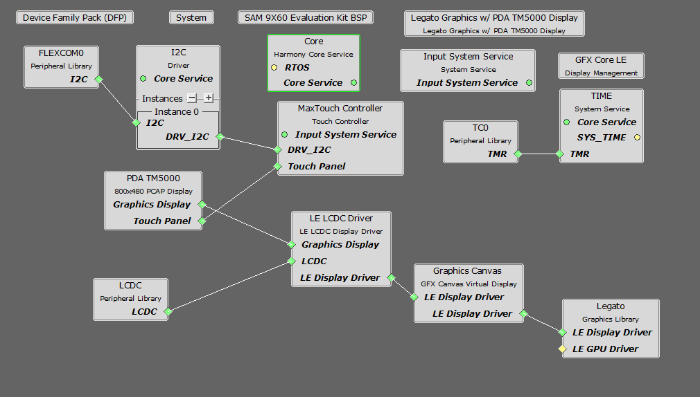

 legato\_canvas\_quickstart\_9x60\_ek\_tm5000.X

Defining the Architecture
-------------------------

This simple application demonstrates use of Canvas library to move assets drawn in an overlay. A user can move a black panel with some logo and fonts drawn to overlay 1 with a swipe gesture while pressing down anywhere in the black area of the rectangle. The grey panel is drawn on a different overlay and pressing the button on this overlay moves the black panel back to home position.

User touch input on the display panel is received through the PCAP capacitive touch controller, which sends a notification to the Touch Input Driver. The Touch Input Driver reads the touch information over I2C and sends the touch event to the Graphics Library thru the Input System Service.

### Demonstration Features

-   Legato Graphics Library 
-   Reference application for the SAM 9x60
-   24-bit color, multi-layer, WVGA (800x480) screen design
-   Time system service, timer-counter peripheral library and driver 
-   Graphics Acceleration using integrated display controller (LCDC)
-   I2C and touch controller driver
-   Graphics Canvas

Creating the Project Graph
--------------------------

The Project Graph diagram shows the Harmony components that are included in this application. Lines between components are drawn to satisfy components that depend on a capability that another component provides.

Adding the **SAM 9x60 Evaluation Kit BSP** and **Legato Graphics w/ PDA TM5000 Display** Graphics Template component into the project graph will automatically add the components needed for a graphics project and resolve their dependencies. It will also configure the pins needed to drive the external peripherals like the display and the touch controller.

Building the Application
------------------------

The parent directory for this application is gfx/apps/legato\_canvas\_quickstart. To build this application, use MPLAB X IDE to open the gfx/apps/legato\_canvas\_quickstart/firmware/legato\_cqs\_9x60\_ek\_tm5000.X project folder and press F11.
A successful build will generate a harmony.bin file in dist\lcdc_rgba8888_mxt_9x60_wvga\production in the project folder.

The following table lists configuration properties:

|Project Name|BSP Used|Graphics Template Used|Description|
|:-----------|:-------|:---------------------|:----------|
|legato\_cqs\_9x60\_ek\_tm5000.X|[SAM 9x60 Evaluation Kit](https://www.microchip.com/developmenttools/ProductDetails/DT100126)|Legato Graphics w/ PDA TM5000 Display|[SAM 9x60 Evaluation Kit](https://www.microchip.com/developmenttools/ProductDetails/DT100126) with RGBA8888 GFX Interface and [5" WVGA PCAP Touch display](https://www.microchip.com/DevelopmentTools/ProductDetails/PartNO/AC320005-5)|

> \*\*\_NOTE:\_\*\* This application may contain custom code that is marked by the comments // START OF CUSTOM CODE ... and // END OF CUSTOM CODE. When using the MPLAB Harmony Configurator to regenerate the application code, use the "ALL" merging strategy and do not remove or replace the custom code.

Configuring the Hardware
------------------------

Configure the hardware as follows:

-   Connect the ribbon cable from the display to the J15 connector on the back of the SAM 9x60 Evaluation Kit board.

-	Take an SD Card formatted with FAT32 file system, and copy the boot.bin binary file from this [location](../../../boot_image/boot.bin). Also copy the harmony.bin file you generated from the "Building the Application" section.

-   Insert the SD card to J4 of the SAM 9X60 Evaluation kit and power up the board by connecting the power adapter to power connector J1 or a powered USB cable to the USB port J7 on the SAM 9x60 Evaluation Kit board.

Running the Demonstration
-------------------------

When power-on is successful, the demonstration will display an image similar to the picture shown below (different configurations may have slight variation in the screen aspect ratio):

The black LCD panel can be moved around by pressing down on it. Please note that you can press anywhere outside the grey panel. Pressing the button in the grey panel will bring the black panel back to home position.

* * * * *

 
