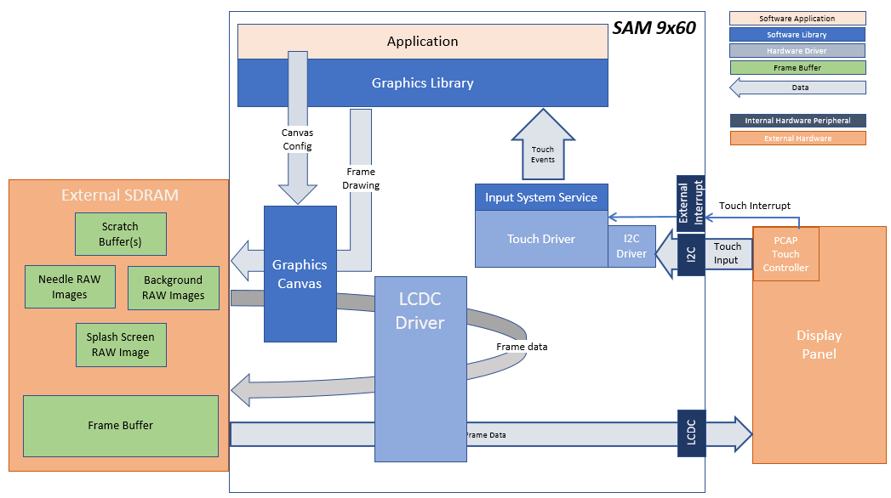
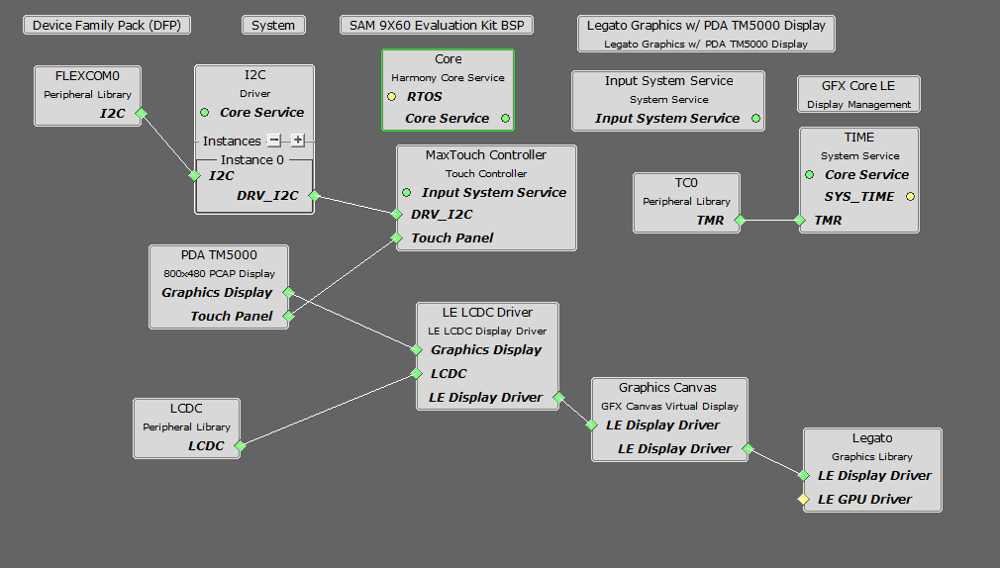
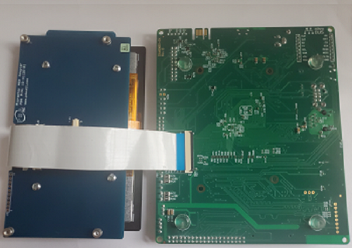
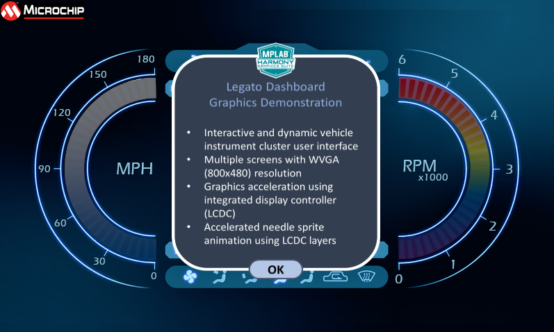
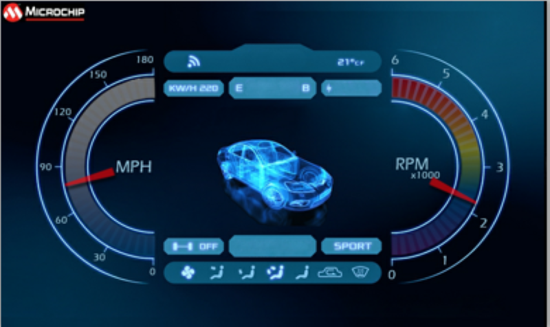
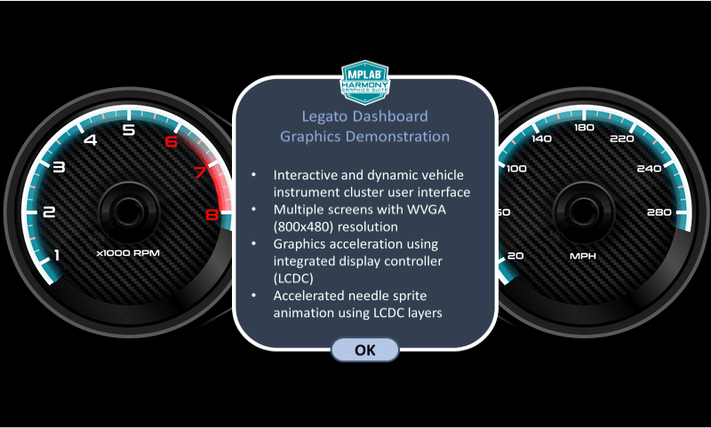

 legato\_dashboard\_9x60\_ek\_tm5000.X

Defining the Architecture
-------------------------

The demo uses pre-rotated, RAW needle sprite images in SDRAM to show two rotating needles overlaid on top of a dashboard background image.  The application code uses the Graphics Canvas library to configure sprite animation and overlay of the needles using the LCDC layers.  The application also uses Graphics Canvas to showcase smooth panel movement and ultra-wide frame buffer scrolling.  The frame buffer is populated with two 800x480 background dashboard image.  With a simple swipe gesture, the application will slide from one dashboard design to the other.

There is no image preprocessing involved.  All images are in RAW format and are automatically loaded into SDRAM at device power-up.  

User touch input on the display panel is received thru the PCAP capacitive touch controller, which sends a notification to the Touch Input Driver. The Touch Input Driver reads the touch information over I2C and sends the touch event to the Graphics Library thru the Input System Service. The needles are rotated based on the location of the touch events on the screen.

### Demonstration Features

-   Legato Graphics Library and Graphics Canvas
-   Reference application for the SAM 9x60
-   24-bit color, multi-layer, WVGA (800x480) screen design
-   Time system service, timer-counter peripheral library and driver 
-   Graphics Acceleration using integrated display controller (LCDC)
-   I2C and touch controller driver 

Creating the Project Graph
--------------------------

The Project Graph diagram shows the Harmony components that are included in this application. Lines between components are drawn to satisfy components that depend on a capability that another component provides.

Adding the **SAM 9x60 Evaluation Kit BSP** and **Legato Graphics w/ PDA TM5000 Display** Graphics Template component into the project graph will automatically add the components needed for a graphics project and resolve their dependencies. It will also configure the pins needed to drive the external peripherals like the display and the touch controller.

Building the Application
------------------------

The parent directory for this application is gfx/apps/legato\_dashboard. To build this application, use MPLAB X IDE to open the gfx/apps/legato\_dashboard/firmware/legato\_db\_9x60\_ek\_tm5000.X project folder and press F11.
A successful build will generate a harmony.bin file in dist\lcdc_rgba8888_mxt_9x60_wqvga\production in the project folder.

The following table lists configuration properties:

|Project Name|BSP Used|Graphics Template Used|Description|
|:-----------|:-------|:---------------------|:----------|
|legato\_db\_9x60\_ek\_tm5000.X|[SAM 9x60 Evaluation Kit](https://www.microchip.com/developmenttools/ProductDetails/DT100126)|Legato Graphics w/ PDA TM5000 Display|[SAM 9x60 Evaluation Kit](https://www.microchip.com/developmenttools/ProductDetails/DT100126) with RGBA8888 GFX Interface and [5" WVGA PCAP Touch display](https://www.microchip.com/DevelopmentTools/ProductDetails/PartNO/AC320005-5)|

> \*\*\_NOTE:\_\*\* This application may contain custom code that is marked by the comments // START OF CUSTOM CODE ... and // END OF CUSTOM CODE. When using the MPLAB Harmony Configurator to regenerate the application code, use the "ALL" merging strategy and do not remove or replace the custom code.

Configuring the Hardware
------------------------

Configure the hardware as follows:

-   Connect the ribbon cable from the display to the J15 connector on the back of the SAM 9x60 Evaluation Kit board.

-	Take an SD Card formatted with FAT32 file system, and copy the boot.bin binary file from this [location](../../../boot_image/boot.bin). Also copy the harmony.bin file you generated from the "Building the Application" section.

-   Insert the SD card to J4 of the SAM 9X60 Evaluation kit and power up the board by connecting the power adapter to power connector J1 or a powered USB cable to the USB port J7 on the SAM 9x60 Evaluation Kit board.

Running the Demonstration
-------------------------

When power-on is successful, the demonstration will display a static splash screen for about 5 seconds.  

The splash screen will fade to the following screen:

Touching "OK" and the center sub-window will slide up and out of the screen.  The needles for the dashboard will appear.  Touching anywhere on the meter area and the needles for the dashboard will move at various angles.

Swiping from right to left near the top or bottom of the screen and the screen will transition from one dashboard design to another.  

Similarly, the help sub-window can slide off screen and needles for the other dashboard design appears.

* * * * *

 
