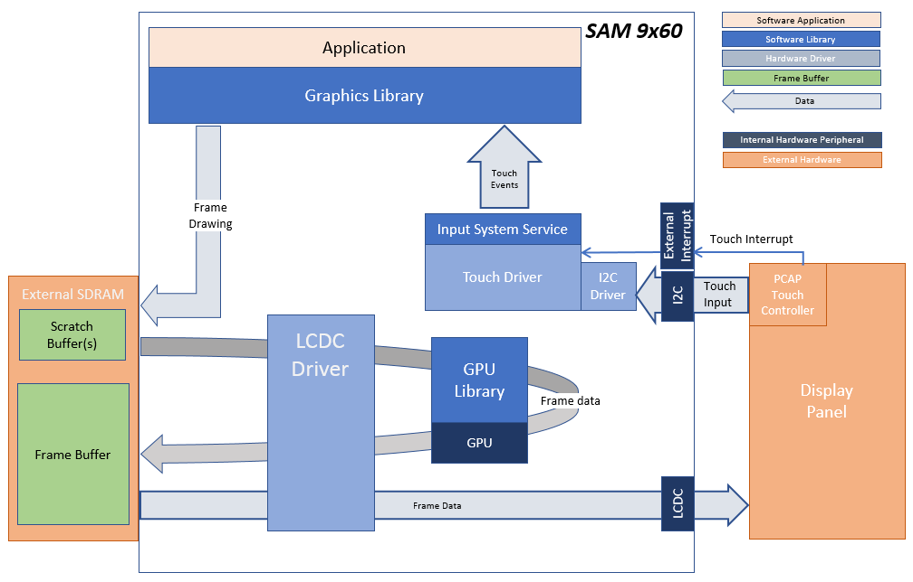
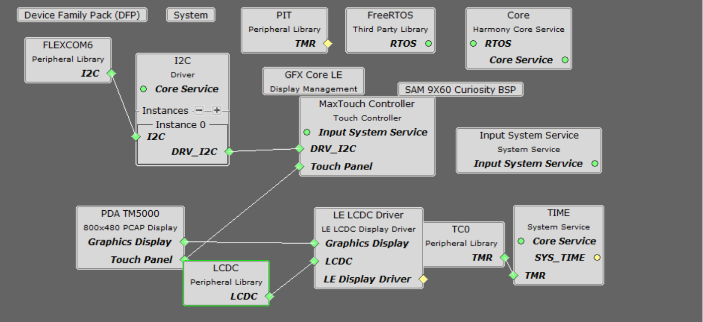
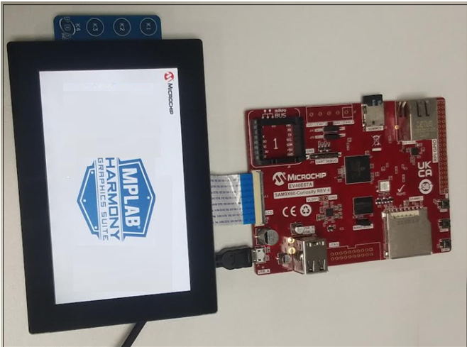
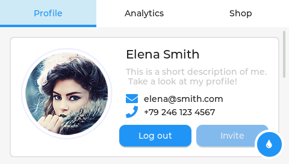

 lvgl\_showcase\_9x60\_cu\_tm5000.X

Defining the Architecture
-------------------------

This application demonstrates single-layer, WVGA graphics using SDRAM memory.

User touch input on the display panel is received thru the PCAP capacitive touch controller, which sends a notification to the Touch Input Driver. The Touch Input Driver reads the touch information over I2C and sends the touch event to the Graphics Library thru the Input System Service.

### Demonstration Features

-   LVGL Graphics Library (v8.3.7 Release)
-   Reference application for the SAM 9x60 Curiosity development board
-   16-bit RGB565 color, single-layer, WVGA (800x480) screen design
-   Time system service, timer-counter peripheral library and driver 
-   Graphics supported using integrated display controller (LCDC)
-   I2C and touch controller driver 

Creating the Project Graph
--------------------------

The Project Graph diagram shows the Harmony components that are included in this application. Lines between components are drawn to satisfy components that depend on a capability that another component provides.

Building the Application
------------------------

The parent directory for this application is gfx/apps/lvgl\_showcase. To build this application, use MPLAB X IDE to open the gfx/apps/lvgl\_showcase/firmware/lvgl\_sc\_9x60\_cu\_tm5000.X project folder and press F11.
A successful build will generate a harmony.bin file in dist\lcdc_rgb565_mxt_9x60_cu_wqvga\production in the project folder.

The following table lists configuration properties:

|Project Name|BSP Used|Graphics Template Used|Description|
|:-----------|:-------|:---------------------|:----------|
|lvgl\_qs\_9x60\_cu\_tm5000.X|[SAM 9X60 CURIOSITY BSP](https://www.microchip.com/en-us/development-tool/EV40E67A) |Legato Graphics w/ PDA TM5000 Display|[SAM 9x60 Curiosity development board](https://www.microchip.com/en-us/development-tool/EV40E67A) with RGBA8888 GFX Interface and [5" WVGA PCAP Touch display](https://www.microchip.com/DevelopmentTools/ProductDetails/PartNO/AC320005-5)|

> \*\*\_NOTE:\_\*\* This application may contain custom code that is marked by the comments // START OF CUSTOM CODE ... and // END OF CUSTOM CODE. When using the MPLAB Harmony Configurator to regenerate the application code, use the "ALL" merging strategy and do not remove or replace the custom code.

Configuring the Hardware
------------------------

Configure the hardware as follows:

-   Connect the ribbon cable from the display to the J13 connector of the SAM 9x60 Curiosity Development Board.

-	Take an SD Card formatted with FAT32 file system, and copy the boot.bin binary file from this [location](../../../Sam9x60_Curiosity/boot.bin). Also copy the harmony.bin file you generated from the "Building the Application" section.

-   Insert the SD card to J3 of the SAM 9X60 Curiosity development board and power up the board by connecting the powered USB cable to the USB port J1 on the SAM 9x60 curiosity development board.

Running the Demonstration
-------------------------

When power-on is successful, the demonstration will display a menu similar to that shown in the following figure:

* * * * *

 
